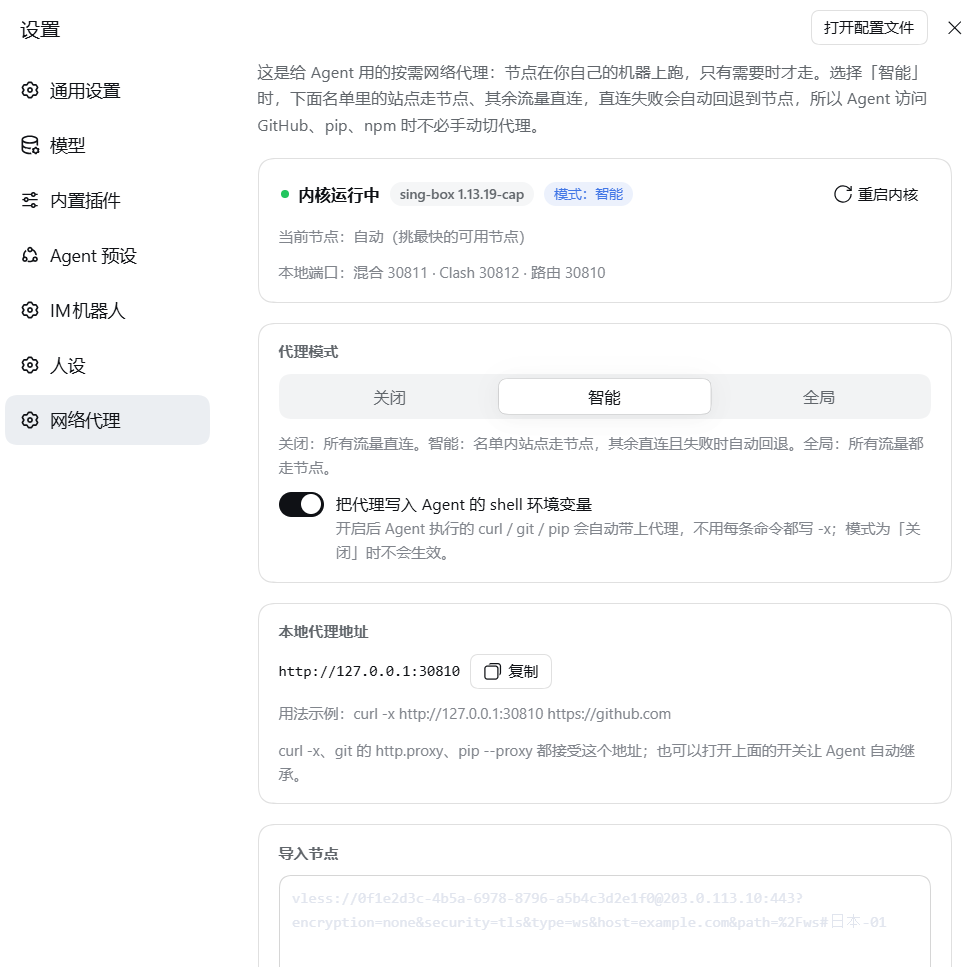
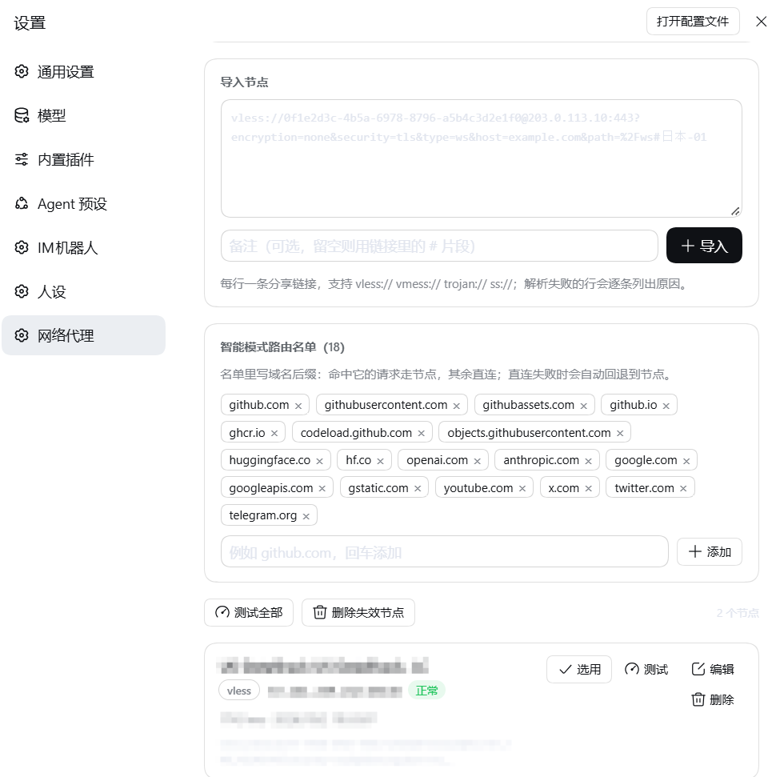

<div align="center">

# dsh-egress-router

**给 DeepSeek Harness 的按需网络出海：粘贴节点链接，Agent 就能在直连被阻断时临时走代理。**

[](https://github.com/gswenxue/dsh-egress-router/releases)
[](LICENSE)
[](#平台支持)
[](https://github.com/topics/dsh-plugin)
[](https://dsh-plugin.org/plugins/gswenxue/dsh-egress-router)

</div>

## 它解决什么问题

`github.com` 连不上、`pip install` 卡住、Agent 抓不到网页——但你又不想让**所有**流量都绕道境外。
这个插件做的是**选择性出海**：导入你自己的 vless / vmess / trojan / ss 节点，然后只让该走节点的流量走节点，其余保持直连，直连失败时自动回退。

装完在 **设置 → 网络代理** 里粘贴链接即可；Agent 侧会多出一个 `net_proxy` 工具，终端里的 `curl` / `git` / `pip` / `npm` 也会自动按同一策略走，不用每条命令加 `-x`。

## 特性

- **三种模式**：`关闭`（全直连）/ `智能`（名单内走节点，其余直连，失败自动回退）/ `全局`（都走节点）
- **按需回退，不是"连不上才回退"**：受审查网络里 TCP 往往连得上、握手才被掐断。`CONNECT` 隧道 4 秒内没有回程字节会被判定为黑洞，自动改用节点并**重放客户端已发出的 TLS 字节**，客户端无感；普通 HTTP 请求 6 秒无响应头则同 body 重试。回退过的域名会记住，后续请求不再付探测开销
- **节点有状态**：`正常` / `失效` / `本机不可用`（例如本机没有 IPv6 出口时的 IPv6 单栈节点）。**绝不自动删除节点**；失效只改状态并让后续调用避开，删除只在你手动点击时发生
- **注释可见**：你给节点写的备注，Agent 调用时也能看到（`list` 返回备注与状态）
- **四种链接**：`vless://`（含 Reality）、`vmess://`、`trojan://`、`ss://`，可多行批量导入
- **内核随用随取**：sing-box 以 Release 附件分发，首次需要时自动下载并校验 SHA-256，不占仓库体积
- **不碰 Harness 的出站策略**：只注入**子进程**的代理环境变量，从不替换 Harness 自己的网络 dispatcher，模型调用不会被代理拖累或中断

## 安装

```bash
# 推荐：直接从 GitHub 安装（插件名 dsh-egress-router）
dsh plugin --profile web add github:gswenxue/dsh-egress-router
```

装完后重启一次 DSH Web（或让 profile 就绪后重新打开页面），设置里就会出现 **网络代理**。

<details>
<summary>其他安装方式</summary>

```bash
# 用仓库地址（等价）
dsh plugin --profile web add https://github.com/gswenxue/dsh-egress-router

# 从 Release 的源码压缩包安装
dsh plugin --profile web add https://github.com/gswenxue/dsh-egress-router/archive/refs/tags/v0.1.0.tar.gz

# 本地开发：把工作副本 link 进 profile
#   package.json: "dsh-egress-router": "link:/path/to/dsh-egress-router"
#   并加入 dsh.profile.bundles
```

也可以在 Web 界面 **设置 → 插件 → 添加插件** 里粘贴同样的地址。
</details>

## 快速上手

1. **导入节点**：设置 → 网络代理 → 粘贴一条或多条分享链接 → 导入（备注取链接里的 `#` 片段，可再改）
2. **测一下**：点节点上的「测试」，或工具条的「测试全部」，状态会变成 `正常`
3. **选模式**：默认就是 `智能`，通常不用改；需要全部走节点时切 `全局`
4. **用起来**：Agent 直接干活即可

## 界面

设置 → **网络代理**：内核状态与端口、三种模式、本地代理地址、导入区，一屏看全。



<details>
<summary>节点列表、智能模式路由名单、失效管理与批量测试</summary>



</details>

## 内核（sing-box）

内核不放在仓库里（每个平台 50–65 MB），而是作为 [Release 附件](https://github.com/gswenxue/dsh-egress-router/releases) 提供：

| 平台 | 附件 | 说明 |
|---|---|---|
| Linux x64 | `sing-box-linux-amd64` | 上游 `linux-amd64-musl` 构建，静态链接 |
| Linux arm64 | `sing-box-linux-arm64` | 上游 `linux-arm64-musl` 构建，静态链接 |
| macOS Intel | `sing-box-darwin-amd64` | 上游 `darwin-amd64` 构建 |
| macOS Apple silicon | `sing-box-darwin-arm64` | 上游 `darwin-arm64` 构建 |
| Windows x64 | `sing-box-windows-amd64.exe`（+ `libcronet-windows-amd64.dll`） | 上游 `windows-amd64` 构建 |

- 设置页点 **「下载内核」** 即可自动完成：下载 → 校验 SHA-256 → 落盘 `<DSH_HOME>/integrations/dsh-net-proxy/bin/sing-box` → 启动
- 下载地址与哈希固定在 `lib/core-manifest.js`，可自行核对
- **本机访问 GitHub 受限？** 两种办法：
  1. 把 **「镜像地址」** 指向任何能提供同名文件的地址（例如某个 GitHub 加速前缀：`https://<mirror-host>/https://github.com/gswenxue/dsh-egress-router/releases/download/v0.1.0`），插件会在其后拼接附件名
  2. 手动下载后放到 `<DSH_HOME>/integrations/dsh-net-proxy/bin/sing-box`（Windows 为 `sing-box.exe`），插件会直接使用；也可以放在插件包内的 `bin/` 目录
- 用的是**未修改的上游构建**，来源与许可见 [THIRD_PARTY_NOTICES.md](THIRD_PARTY_NOTICES.md)

## 给 Agent 的能力

| 入口 | 说明 |
|---|---|
| `net_proxy` 工具 | `status` / `list` / `import` / `remove` / `use` / `mode` / `route` / `test` / `clean` / `fetch` / `core`。`fetch` 经节点取网页（自动挑正常节点逐个回退，复测确认失效才标记） |
| 本地 HTTP 代理 | 默认 `http://127.0.0.1:30810`，可直接 `curl -x http://127.0.0.1:30810 https://github.com` |
| 内核 mixed 入口 | 默认 `127.0.0.1:30811`（HTTP + SOCKS5，始终走当前选中节点） |
| 子进程环境变量 | 开启「注入 Agent shell 环境」后，`http_proxy` / `https_proxy` / `all_proxy` / `no_proxy` 指向本地路由器；关闭或切到 `关闭` 模式会原样还原 |

## 权限与安全（请先读）

- 插件在本机以**你的用户权限**运行，会：
  - 监听 `127.0.0.1` 上的三个端口（默认 30810 本地代理 / 30811 内核 mixed / 30812 内核 Clash API，均只绑定回环地址）
  - 启动一个 `sing-box` 子进程，并按需**下载**该可执行文件（仅在你点击「下载内核」或首次需要时）
  - 读写 `<DSH_HOME>/integrations/dsh-net-proxy/`（`state.json` 节点库、`sing-box.json` 生成配置、`sing-box.log` 内核日志）
  - 按设置**覆盖当前进程的代理环境变量**，使 Agent 启动的子进程走本地代理（卸载时会还原）
- **节点信息只存在本地**：`state.json` 含节点链接（内含 UUID/密码等凭据），请勿把该文件分享出去；本仓库**不含**任何节点数据
- 不收集遥测、不访问除你配置的节点与内核下载地址之外的任何服务
- 插件不修改 Harness 的全局 dispatcher：Harness 自身的 `web_fetch` 按设计**豁免进程级代理**，模型调用与遥测也不受影响

## 配置项

| 位置 | 项 | 默认 |
|---|---|---|
| 设置 → 网络代理 | 模式 | `智能` |
| 设置 → 网络代理 | 注入 Agent shell 环境 | 开 |
| 设置 → 网络代理 | 路由名单（智能模式强制走节点的域名后缀） | `github.com`、`githubusercontent.com`、`huggingface.co`、`google.com`、`x.com` … |
| 设置 → 网络代理 | 镜像地址 | 空（用固定 Release 地址） |
| `state.json` | `routerPort` / `mixedPort` / `clashPort` | `30810` / `30811` / `30812` |

## 实测输出（本机真实结果）

```
$ curl -sS -o /dev/null -w "%{http_code} %{time_total}s\n" https://github.com
200 4.410922s

$ curl -sS https://api.github.com/rate_limit | head -c 60
{"resources":{"code_search":{"limit":60,"remaining":56,"r

$ git clone --depth 1 https://github.com/octocat/Hello-World /tmp/hello && git -C /tmp/hello log --oneline -1
7fd1a60 Merge pull request #6 from Spaceghost/patch-1

$ net_proxy test
节点测试结果：
- 节点A · 203.0.113.10:443 · 正常 713ms
- 节点B · node.example.com:443 · 正常 1530ms
```

被阻断域名的自动回退（路由器决策日志，`via` 为最终走向）：

```
github.com              → proxy
ghproxy.com             → fallback（直连 4000ms 无回应）→ proxy
registry.npmjs.org      → direct
```

## 兼容性

- **DSH**：实测于 `0.2.0-rc.2`（Web profile）。插件不声明强制 DSH peer 范围，安装不会被版本检查拦下
- **Node**：随 DSH 运行时（实测 Node 22）
- **平台**：Linux / macOS / Windows，见上文内核表；其他架构需自行准备内核
- **不支持的输入**：订阅链接（`http(s)://`）、`hysteria` / `tuic` / `wireguard` 等协议暂不支持

## 已知限制

- **Harness 自带的 `web_fetch` 不走代理**：DSH 的这个调用点故意把请求钉在已校验地址上，官方设计上豁免进程级 dispatcher。要取被阻断站点，请用 `net_proxy` 工具或终端里的 `curl`
- **ws 路径里的查询串**：`path=/xxx?ed=2048` 中的 `ed` 是 Xray 的客户端早发数据指令，不属于 HTTP 请求行；本插件已把它翻译成 sing-box 的 `max_early_data`（否则会被转义成 `%3F` 导致服务端 404）
- **本机没有 IPv6 出口时**，IPv6 单栈节点标为「本机不可用」并跳过：不算失效、不会被删除，换台有 IPv6 的机器即可用
- **插件不支持自动更新**：升级请卸载后重装
- 节点数上限 200，单次 `fetch` 默认截断 60000 字节

## 第三方组件

内核为 **sing-box**（[SagerNet/sing-box](https://github.com/SagerNet/sing-box)，GPL-3.0-or-later，附加上游许可条款）的**未修改上游构建**，按 Release 附件分发。详见 [THIRD_PARTY_NOTICES.md](THIRD_PARTY_NOTICES.md)。

## License

[MIT](LICENSE) © 2026 gswenxue

---

<details>
<summary><b>English</b></summary>

**dsh-egress-router** — on-demand egress routing for DeepSeek Harness. Import your own vless / vmess / trojan / ss
nodes, then let only the traffic that needs it go through a node: `auto` mode routes a configurable domain list
through the node, keeps everything else direct, and falls back to the node when a direct connection is blackholed
(watchdog + TLS byte replay). Nodes keep a status (`ok` / `failed` / `unavailable here`), are never deleted
automatically, and their remarks are visible to the agent through the `net_proxy` tool. The sing-box core is fetched
from GitHub Release assets with SHA-256 verification, so the repository stays small.

Install: `dsh plugin --profile web add github:gswenxue/dsh-egress-router`

Runs with your user's permissions: it binds three loopback ports, spawns the sing-box core, stores the node library
under `$DSH_HOME/integrations/dsh-net-proxy/`, and (when enabled) points the agent's child-process proxy environment
variables at the local router. No telemetry. MIT licensed; the bundled core is an unmodified GPL-3.0 upstream build.

</details>
